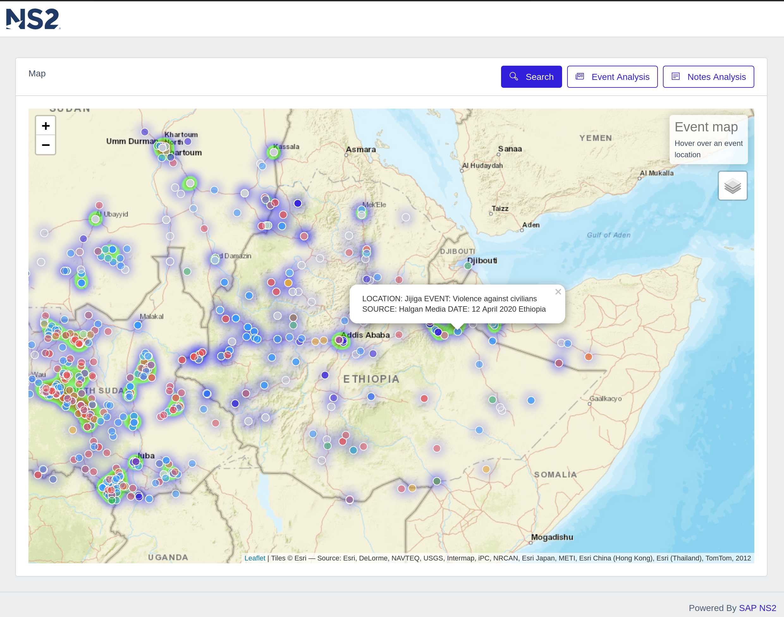

# Global Conflict Analysis Platform

Data Visualization frontend that is deployable on both [Heroku](https://www.heroku.com/) and [SAP Cloud Platform](https://cloudplatform.sap.com/index.html)



## Requirements
* [Mapbox](https://www.mapbox.com/) API key
* [SAP HANA](https://www.sap.com/products/hana.html) Instance Information
    * Host
    * Port
    * Username
    * Password
* [node.js](https://nodejs.org/en/) for local development
* [Cloud Foundry CLI](https://docs.cloudfoundry.org/cf-cli/) for deployment on SAP Cloud Platform

## Deploy
* Add the following environment variables to `$HOME/.bashrc` or `$HOME/.profile`. These are **example** values only.

``` bash
# Required for application
export HDB_HOST=99.11.000.555
export HDB_PORT=10099
export HDB_USER=hanaUser
export HDB_PASSWORD=1hanaPassword
export MAPBOX_TOKEN=pk.veryLongValue

# For deployment on SAP Cloud Platform
export CP_USER=i999888
export CP_PASSWORD=MyPlatformPass
```

### Local
* Install dependencies and then run

```bash
npm install
npm run start
```
* Application with be available at [http://localhost:3000](http://localhost:3000)

### SAP Cloud Platform
* Login with the `cf-login.sh` script
* Push the application using the node.js [buildpack](https://docs.cloudfoundry.org/buildpacks/node/index.html) with `cf-push-buildpack.sh`
* You will be able to view the application route in the SAP Platform Cockpit or you can check the status with `cf app conflict-analysis`
=======
# Global Conflict Analysis Platform

Data Visualization frontend that is deployable locally, with docker or on [SAP Cloud Platform](https://cloudplatform.sap.com/index.html). The supporting data is availabe at the [gca-db](https://github.com/openNS2/gca-db) repository


## Requirements

* [GCA-DB](https://github.com/openNS2/gca-db) project deployed on SAP Cloud Platform as an available service.
* [node.js](https://nodejs.org/en/) for local development
* [Cloud Foundry CLI](https://docs.cloudfoundry.org/cf-cli/) for deployment on SAP Cloud Platform

## Deploy
* Add the following environment variables to `$HOME/.bashrc` or `$HOME/.profile`. These are **example** values only.

``` bash
# For deployment on SAP Cloud Platform
export CP_USER=i999888
export CP_PASSWORD=MyPlatformPass
```

### Local Development
* Install dependencies and then run the script that will query the database service connection values and put in a temporary file

```bash
npm install
./local-run.sh
```
* Application with be available at [http://localhost:3000](http://localhost:3000)

* Any changes will be hot deployed

### Docker Container

> Requires a remote registry to deploy to an external PaaS such as [SAP Cloud Platform](https://cloudplatform.sap.com/index.html.). You can create a free repository and acount at [quay.io](https://quay.io) 

* Build the container and push to a remote repository with
```bash
./docker-build.sh
```

* Run the container with 
```bash
./docker-run.sh
```

## SAP Cloud Platform

* Login with the `cf-login.sh` script to connect your local command line client with the platform.

### SAP HANA Enterprise on Cloud Platform

* Getting the connection information for the application by querying the deployed service with the following command

```bash
cf service-key gca-db gca-db-key
```

* The properties to use are **host, port, user, password**

### Deploy from source code

* SAP Cloud Platform can assemble your container on the platform. Push the application using the [node.js buildpack](https://docs.cloudfoundry.org/buildpacks/node/index.html) with 
```bash
./cf-push-buildpack.sh
```

### Deploy docker container

* SAP Cloud Platform can pull an image from a remote registry and run as a container with
```
./cf-push-docker.sh
```

* You will be able to view the application route in the SAP Platform Cockpit or you can check the status with 
```bash
cf app gca-express
```
